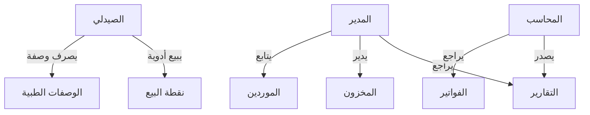
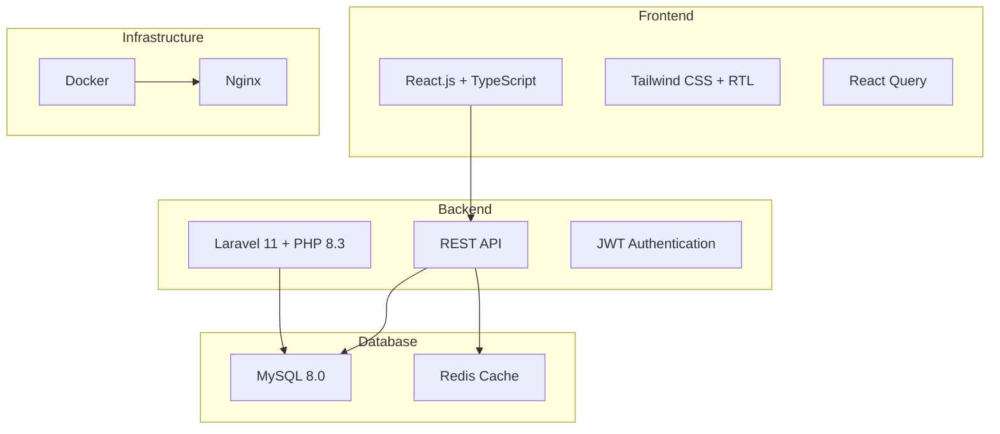
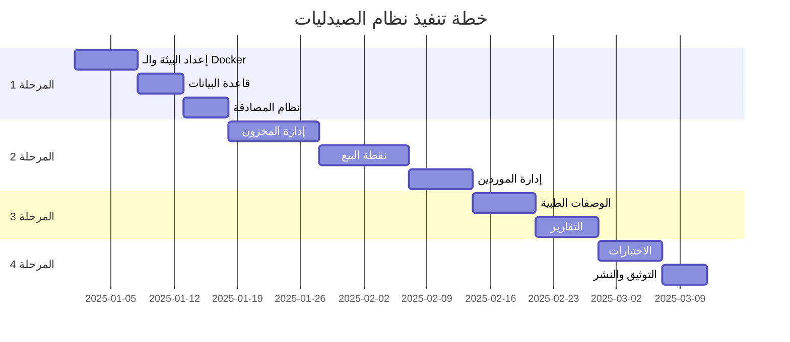

# نظام إدارة الصيدليات - Pharmacy Management System
## مستند متطلبات المنتج (PRD)

---

## 📋 معلومات المشروع

| العنصر | التفاصيل |
|--------|---------|
| **اسم المشروع** | نظام إدارة الصيدليات (PharmaSys) |
| **الإصدار** | 1.0.0 |
| **تاريخ الإنشاء** | 2025-12-26 |
| **المنطقة المستهدفة** | السودان والشرق الأوسط |
| **اللغات** | العربية (أساسي)، الإنجليزية |

---

## 1. نظرة عامة

### 1.1 الرؤية
نظام متكامل وحديث لإدارة الصيدليات مصمم خصيصاً للعمل في السودان والشرق الأوسط، مع:
- ✅ دعم كامل للغة العربية واتجاه RTL
- ✅ قابل للنشر عبر Docker على أي جهاز
- ✅ يعمل في بيئات محدودة الاتصال بالإنترنت
- ✅ متوافق مع المتطلبات التنظيمية المحلية

### 1.2 المشكلة
الصيدليات في السودان والشرق الأوسط تواجه:
- عدم توفر أنظمة تدعم العربية بشكل كامل
- صعوبة تثبيت وتشغيل الأنظمة على أجهزة متنوعة
- عدم التوافق مع العملات المحلية والمتطلبات الضريبية
- انقطاع الإنترنت المتكرر (خاصة في السودان)

### 1.3 الحل
نظام PharmaSys يوفر:
- واجهة عربية بالكامل مع دعم RTL
- Docker Image جاهز للتشغيل على أي جهاز
- وضع العمل بدون إنترنت (Offline Mode)
- دعم متعدد العملات والضرائب

---

## 2. المستخدمون المستهدفون

### 2.1 الأدوار الرئيسية

| الدور | الوصف | الصلاحيات |
|-------|-------|-----------|
| **مدير الصيدلية** | المسؤول الأول عن النظام | كاملة |
| **الصيدلي** | يدير المبيعات والوصفات | بيع، مخزون، وصفات |
| **المحاسب** | يدير الحسابات والتقارير | تقارير مالية، موردين |
| **مساعد صيدلي** | يساعد في البيع والترتيب | بيع محدود |

### 2.2 حالات الاستخدام الرئيسية



---

## 3. الميزات والمتطلبات الوظيفية

### 3.1 إدارة المخزون (Inventory Management)

#### 3.1.1 إدارة الأدوية
| الرقم | الميزة | الأولوية | الوصف |
|-------|--------|---------|-------|
| INV-001 | إضافة دواء | 🔴 عالية | إضافة دواء جديد مع كافة البيانات |
| INV-002 | تعديل دواء | 🔴 عالية | تعديل بيانات دواء موجود |
| INV-003 | حذف دواء | 🟡 متوسطة | حذف أو أرشفة دواء |
| INV-004 | البحث | 🔴 عالية | البحث بالاسم، الباركود، التصنيف |
| INV-005 | استيراد Excel | 🟡 متوسطة | استيراد قائمة أدوية من ملف Excel |
| INV-006 | تصدير Excel | 🟡 متوسطة | تصدير المخزون لملف Excel |

#### 3.1.2 بيانات الدواء المطلوبة
```
📦 معلومات الدواء:
├── الاسم (عربي + إنجليزي)
├── الاسم العلمي (Generic Name)
├── الباركود
├── التصنيف (Category)
├── الشركة المصنعة
├── سعر الشراء
├── سعر البيع
├── الكمية المتوفرة
├── الحد الأدنى للتنبيه
├── تاريخ الصلاحية
├── رقم الدفعة (Batch Number)
├── الموقع في المخزن (Shelf)
├── يحتاج وصفة؟ (نعم/لا)
└── ملاحظات
```

#### 3.1.3 التنبيهات
| الرقم | النوع | الوصف |
|-------|-------|-------|
| INV-007 | نفاد المخزون | تنبيه عند وصول الكمية للحد الأدنى |
| INV-008 | انتهاء الصلاحية | تنبيه قبل 30/60/90 يوم |
| INV-009 | أدوية راكدة | تنبيه للأدوية التي لم تباع منذ فترة |

---

### 3.2 نقطة البيع (POS)

#### 3.2.1 عملية البيع
| الرقم | الميزة | الأولوية | الوصف |
|-------|--------|---------|-------|
| POS-001 | إضافة للسلة | 🔴 عالية | إضافة أدوية بالباركود أو البحث |
| POS-002 | تعديل الكمية | 🔴 عالية | تغيير كمية صنف في السلة |
| POS-003 | حذف من السلة | 🔴 عالية | إزالة صنف من السلة |
| POS-004 | تطبيق خصم | 🟡 متوسطة | خصم على الفاتورة أو الصنف |
| POS-005 | حساب الضريبة | 🔴 عالية | حساب تلقائي للضريبة |
| POS-006 | اختيار الدفع | 🔴 عالية | نقدي، بنكي، آجل |
| POS-007 | طباعة الفاتورة | 🔴 عالية | طباعة فاتورة عربية |
| POS-008 | إرجاع | 🟡 متوسطة | إرجاع بيع سابق |

#### 3.2.2 طرق الدفع
- 💵 نقدي (Cash)
- 🏦 بنكك / فوري (Bank Transfer)
- 💳 بطاقة (Card)
- 📝 آجل (Credit)

#### 3.2.3 العملات المدعومة
| العملة | الرمز | البلد |
|--------|-------|-------|
| جنيه سوداني | SDG | 🇸🇩 السودان |
| ريال سعودي | SAR | 🇸🇦 السعودية |
| درهم إماراتي | AED | 🇦🇪 الإمارات |
| دولار أمريكي | USD | عام |

---

### 3.3 إدارة الموردين (Suppliers)

| الرقم | الميزة | الأولوية | الوصف |
|-------|--------|---------|-------|
| SUP-001 | إضافة مورد | 🔴 عالية | تسجيل بيانات مورد جديد |
| SUP-002 | طلب شراء | 🔴 عالية | إنشاء طلب شراء للمورد |
| SUP-003 | استلام بضاعة | 🔴 عالية | تسجيل استلام وإضافة للمخزون |
| SUP-004 | فواتير الشراء | 🔴 عالية | تسجيل فواتير الموردين |
| SUP-005 | المستحقات | 🟡 متوسطة | متابعة المبالغ المستحقة |
| SUP-006 | تقارير الموردين | 🟢 منخفضة | تقارير أداء الموردين |

---

### 3.4 إدارة العملاء (Customers)

| الرقم | الميزة | الأولوية | الوصف |
|-------|--------|---------|-------|
| CUS-001 | إضافة عميل | 🟡 متوسطة | تسجيل عميل جديد |
| CUS-002 | سجل المشتريات | 🟡 متوسطة | عرض تاريخ المشتريات |
| CUS-003 | الوصفات | 🟡 متوسطة | وصفات العميل السابقة |
| CUS-004 | الحساب الآجل | 🟡 متوسطة | متابعة الديون |
| CUS-005 | نقاط الولاء | 🟢 منخفضة | نظام نقاط ومكافآت |

---

### 3.5 الوصفات الطبية (Prescriptions)

| الرقم | الميزة | الأولوية | الوصف |
|-------|--------|---------|-------|
| PRE-001 | إدخال وصفة | 🔴 عالية | تسجيل وصفة جديدة |
| PRE-002 | ربط بالعميل | 🔴 عالية | ربط الوصفة بالمريض |
| PRE-003 | صرف الوصفة | 🔴 عالية | صرف أدوية الوصفة |
| PRE-004 | تجديد الوصفة | 🟡 متوسطة | تجديد وصفة متكررة |
| PRE-005 | تحقق التفاعلات | 🟢 منخفضة | التحقق من تفاعلات الأدوية |

#### بيانات الوصفة
```
📋 معلومات الوصفة:
├── رقم الوصفة
├── تاريخ الوصفة
├── اسم الطبيب
├── تخصص الطبيب
├── اسم المريض / رقم الهوية
├── الأدوية الموصوفة
│   ├── اسم الدواء
│   ├── الجرعة
│   ├── عدد المرات
│   └── المدة
├── التشخيص (اختياري)
└── ملاحظات
```

---

### 3.6 التقارير والإحصائيات (Reports)

| الرقم | التقرير | الأولوية | الوصف |
|-------|---------|---------|-------|
| REP-001 | تقرير المبيعات | 🔴 عالية | يومي، أسبوعي، شهري، سنوي |
| REP-002 | تقرير المخزون | 🔴 عالية | الكميات الحالية والقيم |
| REP-003 | تقرير الأرباح | 🔴 عالية | الإيرادات والمصروفات |
| REP-004 | الأدوية الأكثر مبيعاً | 🟡 متوسطة | Top selling medicines |
| REP-005 | تقرير الصلاحية | 🔴 عالية | أدوية قاربت على الانتهاء |
| REP-006 | تقرير الموردين | 🟡 متوسطة | المشتريات حسب المورد |
| REP-007 | تقرير العملاء | 🟡 متوسطة | تقرير الحسابات الآجلة |
| REP-008 | تقرير الضرائب | 🔴 عالية | للجهات الحكومية |

#### تصدير التقارير
- 📄 PDF (عربي)
- 📊 Excel
- 🖨️ طباعة مباشرة

---

### 3.7 إدارة المستخدمين (Users & Roles)

| الرقم | الميزة | الأولوية | الوصف |
|-------|--------|---------|-------|
| USR-001 | تسجيل الدخول | 🔴 عالية | مصادقة آمنة |
| USR-002 | إدارة المستخدمين | 🔴 عالية | إضافة/تعديل/حذف |
| USR-003 | الأدوار والصلاحيات | 🔴 عالية | تخصيص صلاحيات |
| USR-004 | سجل النشاطات | 🔴 عالية | تتبع جميع العمليات |
| USR-005 | 2FA | 🟢 منخفضة | المصادقة الثنائية |

---

## 4. المتطلبات غير الوظيفية

### 4.1 الأداء
| المتطلب | المعيار |
|---------|---------|
| زمن التحميل | < 3 ثواني |
| عمليات POS | < 1 ثانية |
| البحث | < 500 مللي ثانية |
| التقارير | < 5 ثواني |

### 4.2 الأمان
- 🔐 تشفير كلمات المرور (bcrypt)
- 🔒 HTTPS إلزامي
- 🛡️ حماية من CSRF, XSS, SQL Injection
- 📝 سجل كامل للعمليات (Audit Log)
- ⏰ انتهاء الجلسة التلقائي

### 4.3 التوفر
- 💯 99.9% uptime (للإصدار السحابي)
- 📦 نسخ احتياطي يومي
- 🔄 استعادة سريعة للبيانات

### 4.4 قابلية التوسع
- 👥 حتى 100 مستخدم متزامن
- 📦 حتى 100,000 صنف
- 📄 حتى 1,000,000 فاتورة

---

## 5. التقنيات المقترحة

### 5.1 Stack التقني



### 5.2 الأسباب

| التقنية | السبب |
|---------|-------|
| **Laravel** | شائع، مجتمع عربي كبير، سهل الصيانة |
| **React** | مرن، دعم RTL ممتاز، أداء عالي |
| **MySQL** | مجاني، موثوق، دعم Unicode كامل |
| **Docker** | يضمن التشغيل على أي جهاز |
| **Tailwind** | سريع، RTL سهل، حجم صغير |

---

## 6. متطلبات Docker

### 6.1 الخدمات المطلوبة
```yaml
services:
  # التطبيق الرئيسي
  app:
    image: pharmasys:latest
    ports: ["8000:8000"]
    
  # قاعدة البيانات
  mysql:
    image: mysql:8.0
    ports: ["3306:3306"]
    
  # خادم الويب
  nginx:
    image: nginx:alpine
    ports: ["80:80", "443:443"]
    
  # التخزين المؤقت
  redis:
    image: redis:alpine
    ports: ["6379:6379"]
```

### 6.2 متطلبات الأجهزة
| المتطلب | الحد الأدنى | الموصى به |
|---------|-------------|-----------|
| RAM | 2 GB | 4 GB |
| CPU | 2 Cores | 4 Cores |
| Storage | 20 GB | 50 GB |
| OS | Windows 10+ / Ubuntu 20+ | Ubuntu 22 LTS |

---

## 7. الجدول الزمني المقترح



---

## 8. الملحقات

### 8.1 قائمة التصنيفات الافتراضية
```
📁 تصنيفات الأدوية:
├── مضادات حيوية (Antibiotics)
├── مسكنات (Analgesics)
├── مضادات التهاب (Anti-inflammatory)
├── أدوية القلب (Cardiovascular)
├── أدوية السكري (Diabetes)
├── أدوية الضغط (Hypertension)
├── فيتامينات ومكملات (Vitamins)
├── أدوية الجهاز الهضمي (GI)
├── أدوية الجهاز التنفسي (Respiratory)
├── مستحضرات تجميل (Cosmetics)
├── أدوية الأطفال (Pediatric)
└── منتجات طبية (Medical Supplies)
```

### 8.2 نموذج الفاتورة

```
╔══════════════════════════════════════╗
║        صيدلية [اسم الصيدلية]         ║
║      ☎ هاتف: XXXX-XXX-XXX           ║
║      📍 العنوان: ...                 ║
╠══════════════════════════════════════╣
║ رقم الفاتورة: INV-00001             ║
║ التاريخ: 2025-12-26 16:30           ║
║ الكاشير: أحمد محمد                  ║
╠══════════════════════════════════════╣
║ الصنف          الكمية   السعر  المجموع ║
║────────────────────────────────────────║
║ باراسيتامول      2     25.00   50.00 ║
║ أموكسيسيلين      1     85.00   85.00 ║
╠══════════════════════════════════════╣
║ المجموع الفرعي:              135.00 ║
║ الضريبة (15%):                20.25 ║
║ ═══════════════════════════════════   ║
║ الإجمالي:                   155.25 ║
╠══════════════════════════════════════╣
║ المدفوع:                    200.00 ║
║ الباقي:                      44.75 ║
╚══════════════════════════════════════╝
        شكراً لزيارتكم 🙏
```

---

## 9. التواصل والدعم

- 📧 البريد: support@pharmasys.com
- 📱 الهاتف: +249-XXX-XXX-XXX
- 💬 واتساب: +249-XXX-XXX-XXX

---

*نهاية المستند*
*الإصدار 1.0 - ديسمبر 2025*
