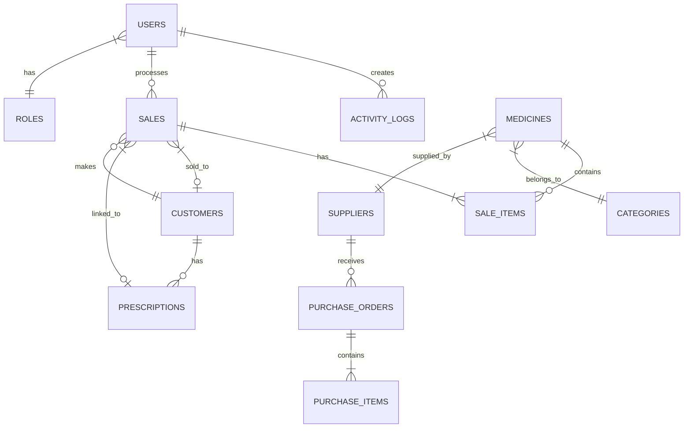

# المتطلبات التقنية - Technical Requirements
## نظام إدارة الصيدليات (PharmaSys)

---

## 1. هيكل قاعدة البيانات (Database Schema)

### 1.1 مخطط العلاقات



---

### 1.2 الجداول الرئيسية

#### جدول المستخدمين (users)
```sql
CREATE TABLE users (
    id BIGINT UNSIGNED PRIMARY KEY AUTO_INCREMENT,
    name VARCHAR(255) NOT NULL,
    email VARCHAR(255) UNIQUE NOT NULL,
    phone VARCHAR(20),
    password VARCHAR(255) NOT NULL,
    role_id INT UNSIGNED NOT NULL,
    avatar VARCHAR(255),
    is_active BOOLEAN DEFAULT TRUE,
    last_login_at TIMESTAMP NULL,
    created_at TIMESTAMP DEFAULT CURRENT_TIMESTAMP,
    updated_at TIMESTAMP DEFAULT CURRENT_TIMESTAMP ON UPDATE CURRENT_TIMESTAMP,
    FOREIGN KEY (role_id) REFERENCES roles(id)
) ENGINE=InnoDB DEFAULT CHARSET=utf8mb4 COLLATE=utf8mb4_unicode_ci;
```

#### جدول الأدوار (roles)
```sql
CREATE TABLE roles (
    id INT UNSIGNED PRIMARY KEY AUTO_INCREMENT,
    name VARCHAR(100) NOT NULL,
    name_ar VARCHAR(100) NOT NULL,
    permissions JSON,
    created_at TIMESTAMP DEFAULT CURRENT_TIMESTAMP
) ENGINE=InnoDB DEFAULT CHARSET=utf8mb4 COLLATE=utf8mb4_unicode_ci;
```

#### جدول الأدوية (medicines)
```sql
CREATE TABLE medicines (
    id BIGINT UNSIGNED PRIMARY KEY AUTO_INCREMENT,
    name VARCHAR(255) NOT NULL,
    name_ar VARCHAR(255),
    generic_name VARCHAR(255),
    barcode VARCHAR(100) UNIQUE,
    category_id INT UNSIGNED,
    supplier_id BIGINT UNSIGNED,
    manufacturer VARCHAR(255),
    unit VARCHAR(50) DEFAULT 'قطعة',
    purchase_price DECIMAL(10,2) NOT NULL,
    selling_price DECIMAL(10,2) NOT NULL,
    quantity INT DEFAULT 0,
    min_quantity INT DEFAULT 10,
    expiry_date DATE,
    batch_number VARCHAR(100),
    shelf_location VARCHAR(50),
    requires_prescription BOOLEAN DEFAULT FALSE,
    description TEXT,
    image VARCHAR(255),
    is_active BOOLEAN DEFAULT TRUE,
    created_at TIMESTAMP DEFAULT CURRENT_TIMESTAMP,
    updated_at TIMESTAMP DEFAULT CURRENT_TIMESTAMP ON UPDATE CURRENT_TIMESTAMP,
    FOREIGN KEY (category_id) REFERENCES categories(id),
    FOREIGN KEY (supplier_id) REFERENCES suppliers(id)
) ENGINE=InnoDB DEFAULT CHARSET=utf8mb4 COLLATE=utf8mb4_unicode_ci;
```

#### جدول التصنيفات (categories)
```sql
CREATE TABLE categories (
    id INT UNSIGNED PRIMARY KEY AUTO_INCREMENT,
    name VARCHAR(100) NOT NULL,
    name_ar VARCHAR(100) NOT NULL,
    parent_id INT UNSIGNED NULL,
    icon VARCHAR(50),
    created_at TIMESTAMP DEFAULT CURRENT_TIMESTAMP,
    FOREIGN KEY (parent_id) REFERENCES categories(id)
) ENGINE=InnoDB DEFAULT CHARSET=utf8mb4 COLLATE=utf8mb4_unicode_ci;
```

#### جدول الموردين (suppliers)
```sql
CREATE TABLE suppliers (
    id BIGINT UNSIGNED PRIMARY KEY AUTO_INCREMENT,
    name VARCHAR(255) NOT NULL,
    contact_person VARCHAR(255),
    phone VARCHAR(20),
    email VARCHAR(255),
    address TEXT,
    city VARCHAR(100),
    country VARCHAR(100) DEFAULT 'السودان',
    tax_number VARCHAR(50),
    notes TEXT,
    is_active BOOLEAN DEFAULT TRUE,
    created_at TIMESTAMP DEFAULT CURRENT_TIMESTAMP,
    updated_at TIMESTAMP DEFAULT CURRENT_TIMESTAMP ON UPDATE CURRENT_TIMESTAMP
) ENGINE=InnoDB DEFAULT CHARSET=utf8mb4 COLLATE=utf8mb4_unicode_ci;
```

#### جدول العملاء (customers)
```sql
CREATE TABLE customers (
    id BIGINT UNSIGNED PRIMARY KEY AUTO_INCREMENT,
    name VARCHAR(255) NOT NULL,
    phone VARCHAR(20),
    email VARCHAR(255),
    address TEXT,
    national_id VARCHAR(50),
    date_of_birth DATE,
    gender ENUM('male', 'female'),
    loyalty_points INT DEFAULT 0,
    credit_limit DECIMAL(10,2) DEFAULT 0,
    credit_balance DECIMAL(10,2) DEFAULT 0,
    notes TEXT,
    created_at TIMESTAMP DEFAULT CURRENT_TIMESTAMP,
    updated_at TIMESTAMP DEFAULT CURRENT_TIMESTAMP ON UPDATE CURRENT_TIMESTAMP
) ENGINE=InnoDB DEFAULT CHARSET=utf8mb4 COLLATE=utf8mb4_unicode_ci;
```

#### جدول المبيعات (sales)
```sql
CREATE TABLE sales (
    id BIGINT UNSIGNED PRIMARY KEY AUTO_INCREMENT,
    invoice_number VARCHAR(50) UNIQUE NOT NULL,
    customer_id BIGINT UNSIGNED NULL,
    user_id BIGINT UNSIGNED NOT NULL,
    prescription_id BIGINT UNSIGNED NULL,
    subtotal DECIMAL(12,2) NOT NULL,
    tax_rate DECIMAL(5,2) DEFAULT 0,
    tax_amount DECIMAL(10,2) DEFAULT 0,
    discount_amount DECIMAL(10,2) DEFAULT 0,
    total_amount DECIMAL(12,2) NOT NULL,
    paid_amount DECIMAL(12,2) NOT NULL,
    change_amount DECIMAL(10,2) DEFAULT 0,
    payment_method ENUM('cash', 'bank', 'card', 'credit') DEFAULT 'cash',
    payment_status ENUM('paid', 'partial', 'unpaid') DEFAULT 'paid',
    notes TEXT,
    created_at TIMESTAMP DEFAULT CURRENT_TIMESTAMP,
    FOREIGN KEY (customer_id) REFERENCES customers(id),
    FOREIGN KEY (user_id) REFERENCES users(id),
    FOREIGN KEY (prescription_id) REFERENCES prescriptions(id)
) ENGINE=InnoDB DEFAULT CHARSET=utf8mb4 COLLATE=utf8mb4_unicode_ci;
```

#### جدول تفاصيل المبيعات (sale_items)
```sql
CREATE TABLE sale_items (
    id BIGINT UNSIGNED PRIMARY KEY AUTO_INCREMENT,
    sale_id BIGINT UNSIGNED NOT NULL,
    medicine_id BIGINT UNSIGNED NOT NULL,
    quantity INT NOT NULL,
    unit_price DECIMAL(10,2) NOT NULL,
    discount DECIMAL(10,2) DEFAULT 0,
    total_price DECIMAL(12,2) NOT NULL,
    FOREIGN KEY (sale_id) REFERENCES sales(id) ON DELETE CASCADE,
    FOREIGN KEY (medicine_id) REFERENCES medicines(id)
) ENGINE=InnoDB DEFAULT CHARSET=utf8mb4 COLLATE=utf8mb4_unicode_ci;
```

#### جدول الوصفات الطبية (prescriptions)
```sql
CREATE TABLE prescriptions (
    id BIGINT UNSIGNED PRIMARY KEY AUTO_INCREMENT,
    prescription_number VARCHAR(50) UNIQUE NOT NULL,
    customer_id BIGINT UNSIGNED NOT NULL,
    doctor_name VARCHAR(255),
    doctor_specialty VARCHAR(100),
    hospital_clinic VARCHAR(255),
    diagnosis TEXT,
    prescription_date DATE NOT NULL,
    issue_date TIMESTAMP DEFAULT CURRENT_TIMESTAMP,
    expiry_date DATE,
    status ENUM('pending', 'dispensed', 'partial', 'expired') DEFAULT 'pending',
    notes TEXT,
    image VARCHAR(255),
    created_by BIGINT UNSIGNED,
    created_at TIMESTAMP DEFAULT CURRENT_TIMESTAMP,
    FOREIGN KEY (customer_id) REFERENCES customers(id),
    FOREIGN KEY (created_by) REFERENCES users(id)
) ENGINE=InnoDB DEFAULT CHARSET=utf8mb4 COLLATE=utf8mb4_unicode_ci;
```

#### جدول أدوية الوصفة (prescription_items)
```sql
CREATE TABLE prescription_items (
    id BIGINT UNSIGNED PRIMARY KEY AUTO_INCREMENT,
    prescription_id BIGINT UNSIGNED NOT NULL,
    medicine_name VARCHAR(255) NOT NULL,
    medicine_id BIGINT UNSIGNED NULL,
    dosage VARCHAR(100),
    frequency VARCHAR(100),
    duration VARCHAR(100),
    quantity INT,
    dispensed_quantity INT DEFAULT 0,
    instructions TEXT,
    FOREIGN KEY (prescription_id) REFERENCES prescriptions(id) ON DELETE CASCADE,
    FOREIGN KEY (medicine_id) REFERENCES medicines(id)
) ENGINE=InnoDB DEFAULT CHARSET=utf8mb4 COLLATE=utf8mb4_unicode_ci;
```

#### جدول طلبات الشراء (purchase_orders)
```sql
CREATE TABLE purchase_orders (
    id BIGINT UNSIGNED PRIMARY KEY AUTO_INCREMENT,
    order_number VARCHAR(50) UNIQUE NOT NULL,
    supplier_id BIGINT UNSIGNED NOT NULL,
    user_id BIGINT UNSIGNED NOT NULL,
    order_date DATE NOT NULL,
    expected_date DATE,
    received_date DATE,
    subtotal DECIMAL(12,2) NOT NULL,
    tax_amount DECIMAL(10,2) DEFAULT 0,
    discount_amount DECIMAL(10,2) DEFAULT 0,
    total_amount DECIMAL(12,2) NOT NULL,
    paid_amount DECIMAL(12,2) DEFAULT 0,
    status ENUM('draft', 'ordered', 'received', 'partial', 'cancelled') DEFAULT 'draft',
    payment_status ENUM('paid', 'partial', 'unpaid') DEFAULT 'unpaid',
    notes TEXT,
    created_at TIMESTAMP DEFAULT CURRENT_TIMESTAMP,
    FOREIGN KEY (supplier_id) REFERENCES suppliers(id),
    FOREIGN KEY (user_id) REFERENCES users(id)
) ENGINE=InnoDB DEFAULT CHARSET=utf8mb4 COLLATE=utf8mb4_unicode_ci;
```

#### جدول سجل النشاطات (activity_logs)
```sql
CREATE TABLE activity_logs (
    id BIGINT UNSIGNED PRIMARY KEY AUTO_INCREMENT,
    user_id BIGINT UNSIGNED NOT NULL,
    action VARCHAR(100) NOT NULL,
    model_type VARCHAR(100),
    model_id BIGINT UNSIGNED,
    old_values JSON,
    new_values JSON,
    ip_address VARCHAR(45),
    user_agent TEXT,
    created_at TIMESTAMP DEFAULT CURRENT_TIMESTAMP,
    FOREIGN KEY (user_id) REFERENCES users(id)
) ENGINE=InnoDB DEFAULT CHARSET=utf8mb4 COLLATE=utf8mb4_unicode_ci;
```

#### جدول الإعدادات (settings)
```sql
CREATE TABLE settings (
    id INT UNSIGNED PRIMARY KEY AUTO_INCREMENT,
    `key` VARCHAR(100) UNIQUE NOT NULL,
    value TEXT,
    type ENUM('string', 'number', 'boolean', 'json') DEFAULT 'string',
    group_name VARCHAR(50),
    created_at TIMESTAMP DEFAULT CURRENT_TIMESTAMP,
    updated_at TIMESTAMP DEFAULT CURRENT_TIMESTAMP ON UPDATE CURRENT_TIMESTAMP
) ENGINE=InnoDB DEFAULT CHARSET=utf8mb4 COLLATE=utf8mb4_unicode_ci;
```

---

## 2. هيكل API Endpoints

### 2.1 المصادقة (Authentication)
```
POST   /api/auth/login          # تسجيل الدخول
POST   /api/auth/logout         # تسجيل الخروج
POST   /api/auth/refresh        # تجديد التوكن
GET    /api/auth/me             # بيانات المستخدم الحالي
PUT    /api/auth/password       # تغيير كلمة المرور
```

### 2.2 الأدوية (Medicines)
```
GET    /api/medicines           # قائمة الأدوية
POST   /api/medicines           # إضافة دواء
GET    /api/medicines/{id}      # تفاصيل دواء
PUT    /api/medicines/{id}      # تعديل دواء
DELETE /api/medicines/{id}      # حذف دواء
GET    /api/medicines/barcode/{code}  # بحث بالباركود
GET    /api/medicines/expiring  # أدوية قاربت الصلاحية
GET    /api/medicines/low-stock # أدوية منخفضة الكمية
POST   /api/medicines/import    # استيراد من Excel
GET    /api/medicines/export    # تصدير لـ Excel
```

### 2.3 المبيعات (Sales / POS)
```
GET    /api/sales               # قائمة المبيعات
POST   /api/sales               # إنشاء فاتورة جديدة
GET    /api/sales/{id}          # تفاصيل فاتورة
POST   /api/sales/{id}/return   # إرجاع فاتورة
GET    /api/sales/{id}/print    # طباعة فاتورة
GET    /api/sales/daily         # مبيعات اليوم
GET    /api/sales/report        # تقرير المبيعات
```

### 2.4 الموردين (Suppliers)
```
GET    /api/suppliers           # قائمة الموردين
POST   /api/suppliers           # إضافة مورد
GET    /api/suppliers/{id}      # تفاصيل مورد
PUT    /api/suppliers/{id}      # تعديل مورد
DELETE /api/suppliers/{id}      # حذف مورد
```

### 2.5 طلبات الشراء (Purchase Orders)
```
GET    /api/purchases           # قائمة الطلبات
POST   /api/purchases           # إنشاء طلب
GET    /api/purchases/{id}      # تفاصيل طلب
PUT    /api/purchases/{id}      # تعديل طلب
POST   /api/purchases/{id}/receive  # استلام البضاعة
```

### 2.6 العملاء (Customers)
```
GET    /api/customers           # قائمة العملاء
POST   /api/customers           # إضافة عميل
GET    /api/customers/{id}      # تفاصيل عميل
PUT    /api/customers/{id}      # تعديل عميل
GET    /api/customers/{id}/purchases  # مشتريات العميل
GET    /api/customers/{id}/prescriptions  # وصفات العميل
```

### 2.7 الوصفات (Prescriptions)
```
GET    /api/prescriptions       # قائمة الوصفات
POST   /api/prescriptions       # إضافة وصفة
GET    /api/prescriptions/{id}  # تفاصيل وصفة
PUT    /api/prescriptions/{id}  # تعديل وصفة
POST   /api/prescriptions/{id}/dispense  # صرف الوصفة
```

### 2.8 التقارير (Reports)
```
GET    /api/reports/sales       # تقرير المبيعات
GET    /api/reports/inventory   # تقرير المخزون
GET    /api/reports/profit      # تقرير الأرباح
GET    /api/reports/expiry      # تقرير الصلاحية
GET    /api/reports/suppliers   # تقرير الموردين
GET    /api/reports/customers   # تقرير العملاء
```

### 2.9 لوحة التحكم (Dashboard)
```
GET    /api/dashboard/stats     # إحصائيات عامة
GET    /api/dashboard/charts    # بيانات الرسوم البيانية
GET    /api/dashboard/alerts    # التنبيهات
```

---

## 3. هيكل المشروع

```
pharmacy-system/
├── docker/
│   ├── Dockerfile
│   ├── docker-compose.yml
│   ├── nginx/
│   │   └── default.conf
│   └── php/
│       └── local.ini
│
├── backend/                    # Laravel Application
│   ├── app/
│   │   ├── Http/
│   │   │   ├── Controllers/
│   │   │   │   ├── Api/
│   │   │   │   │   ├── AuthController.php
│   │   │   │   │   ├── MedicineController.php
│   │   │   │   │   ├── SaleController.php
│   │   │   │   │   ├── SupplierController.php
│   │   │   │   │   ├── CustomerController.php
│   │   │   │   │   ├── PrescriptionController.php
│   │   │   │   │   ├── PurchaseController.php
│   │   │   │   │   ├── ReportController.php
│   │   │   │   │   └── DashboardController.php
│   │   │   │   └── Middleware/
│   │   │   └── Requests/
│   │   ├── Models/
│   │   │   ├── User.php
│   │   │   ├── Role.php
│   │   │   ├── Medicine.php
│   │   │   ├── Category.php
│   │   │   ├── Supplier.php
│   │   │   ├── Customer.php
│   │   │   ├── Sale.php
│   │   │   ├── SaleItem.php
│   │   │   ├── Prescription.php
│   │   │   ├── PurchaseOrder.php
│   │   │   └── ActivityLog.php
│   │   ├── Services/
│   │   │   ├── SaleService.php
│   │   │   ├── InventoryService.php
│   │   │   ├── ReportService.php
│   │   │   └── PrescriptionService.php
│   │   └── Helpers/
│   ├── database/
│   │   ├── migrations/
│   │   └── seeders/
│   ├── routes/
│   │   └── api.php
│   └── resources/
│       └── lang/
│           ├── ar/
│           └── en/
│
├── frontend/                   # React Application
│   ├── src/
│   │   ├── components/
│   │   │   ├── common/
│   │   │   ├── layout/
│   │   │   ├── medicines/
│   │   │   ├── pos/
│   │   │   ├── customers/
│   │   │   ├── suppliers/
│   │   │   ├── prescriptions/
│   │   │   └── reports/
│   │   ├── pages/
│   │   ├── hooks/
│   │   ├── services/
│   │   ├── store/
│   │   ├── locales/
│   │   │   ├── ar.json
│   │   │   └── en.json
│   │   ├── styles/
│   │   └── utils/
│   ├── public/
│   └── package.json
│
├── docs/
│   ├── PRD.md
│   ├── TECHNICAL.md
│   ├── API.md
│   └── DEPLOYMENT.md
│
├── .env.example
├── .gitignore
└── README.md
```

---

## 4. ملفات Docker

### 4.1 Dockerfile
```dockerfile
FROM php:8.3-fpm

# Install dependencies
RUN apt-get update && apt-get install -y \
    git curl libpng-dev libonig-dev libxml2-dev \
    zip unzip libzip-dev libicu-dev

# Install PHP extensions
RUN docker-php-ext-install pdo_mysql mbstring exif pcntl bcmath gd zip intl

# Install Composer
COPY --from=composer:latest /usr/bin/composer /usr/bin/composer

WORKDIR /var/www/html

COPY . .

RUN composer install --no-dev --optimize-autoloader

RUN chown -R www-data:www-data /var/www/html/storage /var/www/html/bootstrap/cache

EXPOSE 9000

CMD ["php-fpm"]
```

### 4.2 docker-compose.yml
```yaml
version: '3.8'

services:
  app:
    build:
      context: ./backend
      dockerfile: ../docker/Dockerfile
    container_name: pharmasys-app
    restart: unless-stopped
    volumes:
      - ./backend:/var/www/html
    networks:
      - pharmasys-network
    depends_on:
      - mysql
      - redis

  nginx:
    image: nginx:alpine
    container_name: pharmasys-nginx
    restart: unless-stopped
    ports:
      - "80:80"
      - "443:443"
    volumes:
      - ./backend:/var/www/html
      - ./docker/nginx/default.conf:/etc/nginx/conf.d/default.conf
    networks:
      - pharmasys-network
    depends_on:
      - app

  mysql:
    image: mysql:8.0
    container_name: pharmasys-mysql
    restart: unless-stopped
    environment:
      MYSQL_DATABASE: pharmasys
      MYSQL_ROOT_PASSWORD: ${DB_PASSWORD}
      MYSQL_USER: pharmasys
      MYSQL_PASSWORD: ${DB_PASSWORD}
    volumes:
      - mysql-data:/var/lib/mysql
    ports:
      - "3306:3306"
    networks:
      - pharmasys-network

  redis:
    image: redis:alpine
    container_name: pharmasys-redis
    restart: unless-stopped
    ports:
      - "6379:6379"
    networks:
      - pharmasys-network

  frontend:
    build:
      context: ./frontend
    container_name: pharmasys-frontend
    restart: unless-stopped
    ports:
      - "3000:3000"
    volumes:
      - ./frontend:/app
      - /app/node_modules
    networks:
      - pharmasys-network

networks:
  pharmasys-network:
    driver: bridge

volumes:
  mysql-data:
```

---

## 5. متطلبات الأمان

### 5.1 المصادقة
- JWT Token مع انتهاء صلاحية (24 ساعة)
- Refresh Token (7 أيام)
- تشفير bcrypt لكلمات المرور
- Rate Limiting للحماية من هجمات القوة الغاشمة

### 5.2 التفويض
- RBAC (Role-Based Access Control)
- Policies لكل Model
- Middleware للتحقق من الصلاحيات

### 5.3 حماية البيانات
- HTTPS إلزامي في الإنتاج
- CORS محدد للنطاقات المسموحة
- SQL Injection Prevention (Eloquent ORM)
- XSS Protection (Blade escaping)
- CSRF Protection

---

## 6. دعم اللغة العربية (RTL)

### 6.1 Frontend
```javascript
// i18n configuration
import i18n from 'i18next';

i18n.init({
  lng: 'ar',
  fallbackLng: 'en',
  resources: {
    ar: { translation: require('./locales/ar.json') },
    en: { translation: require('./locales/en.json') }
  }
});

// RTL Support
document.dir = i18n.language === 'ar' ? 'rtl' : 'ltr';
```

### 6.2 Tailwind RTL
```javascript
// tailwind.config.js
module.exports = {
  content: ['./src/**/*.{js,jsx,ts,tsx}'],
  theme: {
    extend: {},
  },
  plugins: [
    require('tailwindcss-rtl'),
  ],
}
```

---

*نهاية المستند التقني*
*الإصدار 1.0 - ديسمبر 2025*
